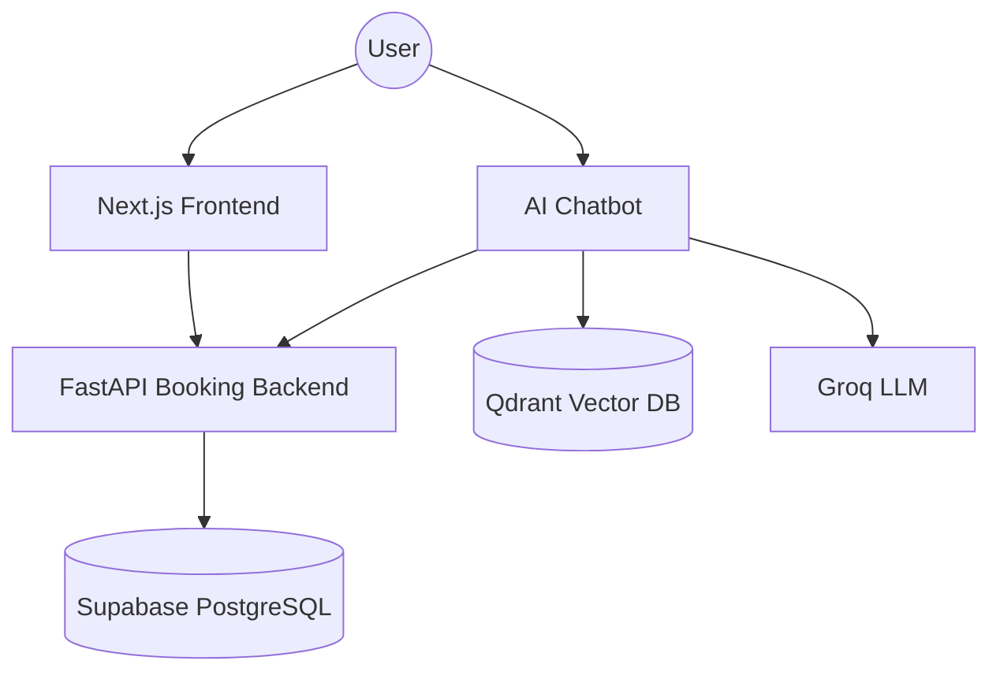

<div align="center">

# Booking AI System

**Nền tảng đặt lịch massage đa dịch vụ, hỗ trợ quản lý lịch theo thời gian thực,  
quy trình booking an toàn và trợ lý AI dành cho khách hàng.**

[](https://www.python.org/)
[](https://fastapi.tiangolo.com/)
[](https://nextjs.org/)
[](https://supabase.com/)
[](https://qdrant.tech/)
[](https://www.docker.com/)

[Kiến trúc](docs/architecture.md) ·
[Thiết kế API](docs/api-design.md) ·
[Thiết kế cơ sở dữ liệu](docs/database-design.md) ·
[Hướng dẫn cài đặt](#hướng-dẫn-cài-đặt)

</div>

---

## Tổng quan

Booking AI System là nền tảng đa dịch vụ dùng để quản lý cửa hàng massage và quy trình đặt lịch của khách hàng.

Hệ thống bao gồm:

- **FastAPI Booking Backend** — nơi chứa toàn bộ business rules và dữ liệu nghiệp vụ cốt lõi, được tổ chức theo kiến trúc phân lớp (api → services → repositories → db);
- **Next.js Frontend** — giao diện dành cho khách hàng và quản trị viên;
- **AI Chatbot Service** độc lập sử dụng Qdrant và Groq;
- **Supabase PostgreSQL** — nơi lưu trữ dữ liệu giao dịch và booking.

Chatbot không truy cập trực tiếp vào các bảng booking. Những dữ liệu theo thời gian thực như shop, course, slot khả dụng và trạng thái booking đều được lấy thông qua Booking Backend API.

> **RAG đã được tách khỏi backend.** Tìm kiếm ngữ nghĩa (Qdrant + Groq) giờ nằm trong
> service Chatbot độc lập. Backend chỉ còn tầng dữ liệu giao dịch (PostgreSQL).

> **Trạng thái dự án:** Backend đã hoàn chỉnh (API booking + kiến trúc phân lớp, RAG/POS đã xóa).
> Chatbot hoàn thiện pipeline RAG + intent routing. Giao diện web đang phát triển.

---

## Chức năng chính

### Quản lý booking

- Quản lý shop, course, therapist và therapist shift
- Quản lý customer restriction và NG list
- Tính toán available slot theo thời gian thực
- Kiểm tra booking eligibility
- Tạo, tra cứu, đổi lịch và hủy booking
- Chống tạo booking trùng bằng Idempotency-Key
- Bảo vệ Admin API bằng JWT
- Chuẩn hóa error response theo RFC 9457
- Quản lý database schema bằng SQLAlchemy 2.0 và Alembic

### AI Assistant

- Truy xuất FAQ và policy bằng Qdrant
- Semantic search với sentence-transformer embeddings
- Intent routing giữa FAQ và các thao tác booking theo thời gian thực
- Tra cứu shop, course và slot thông qua Booking Backend API
- Yêu cầu xác nhận trước khi tạo, cập nhật hoặc hủy booking
- Chạy độc lập và không truy cập trực tiếp database booking

### Web Application

- Quy trình booking dành cho khách hàng
- Tra cứu và hủy booking
- Admin dashboard
- Quản lý shop, course, therapist và therapist shift

> Web Application hiện vẫn đang trong quá trình phát triển.

---

## Kiến trúc hệ thống



### Nguyên tắc thiết kế

1. **Booking Backend là nguồn dữ liệu gốc (source of truth)**  
   Availability, eligibility và các business rules được validate bởi backend.

2. **Chatbot chỉ có quyền truy cập tối thiểu (least-privilege access)**  
   Nó chỉ gọi các public booking endpoint cần thiết và không thể gọi administration API.

3. **RAG data và transactional data được tách biệt**  
   Qdrant lưu FAQ, policy và documentation chunks. Customer và booking information vẫn nằm trong PostgreSQL.

4. **Mutation cần xác nhận (confirmation)**  
   Tạo, đổi lịch và hủy booking đều yêu cầu người dùng xác nhận rõ ràng trước khi API call được thực hiện.

5. **Các service có thể deploy độc lập**  
   Frontend, backend và chatbot mỗi service có runtime và container image riêng.

Xem thêm tại [Tài liệu kiến trúc](docs/architecture.md).

---

## Công nghệ sử dụng

| Area | Technologies |
|---|---|
| Frontend | Next.js, React, TypeScript, Tailwind CSS |
| Booking API | FastAPI, Pydantic, SQLAlchemy 2.0 |
| Database | Supabase PostgreSQL |
| Migrations | Alembic |
| Authentication | Supabase Auth JWT (ES256, verify qua JWKS) |
| AI service | Groq-compatible LLM, sentence-transformers |
| Vector database | Qdrant |
| Testing | Pytest |
| Deployment | Docker, Docker Compose |

---

## Cấu trúc repository

```text
booking-ai-system/
├── booking-ai-system-fe/       # Next.js web application
├── booking-ai-system-be/       # FastAPI Booking Backend
├── booking-ai-chatbot/         # AI assistant and Qdrant RAG service
├── docs/                       # Architecture, API and database documentation
├── docker-compose.yml          # Local multi-service orchestration
└── README.md
```

Mỗi application service có dependency, environment variables, tests và Dockerfile riêng.

---

## Hướng dẫn cài đặt

### Yêu cầu hệ thống

Cần cài đặt:

- Python 3.11 trở lên
- Node.js 20 trở lên
- Docker và Docker Compose
- Một Supabase PostgreSQL project
- Groq API key để chạy Chatbot

### Clone repository

```bash
git clone https://github.com/duy-debug/booking-ai-system.git
cd booking-ai-system
```

---

## Chạy toàn bộ hệ thống bằng Docker Compose

Cách khuyến nghị để khởi động toàn bộ môi trường local:

```bash
docker compose up --build
```

Các service:

| Service | Local URL |
|---|---|
| Frontend | `http://localhost:3000` |
| Booking API | `http://localhost:8000` |
| Booking API documentation | `http://localhost:8000/docs` |
| Chatbot API | `http://localhost:8001` |
| Chatbot API documentation | `http://localhost:8001/docs` |
| Qdrant dashboard | `http://localhost:6333/dashboard` |

Dừng hệ thống:

```bash
docker compose down
```

Dừng hệ thống và xóa local Qdrant volume:

```bash
docker compose down -v
```

---

## Chạy từng service khi phát triển local

### Booking Backend

```bash
cd booking-ai-system-be

python -m venv .venv
```

Windows PowerShell:

```powershell
.venv\Scripts\Activate.ps1
pip install -e .
Copy-Item .env.example .env
```

Chạy database migration:

```powershell
alembic upgrade head
```

Khởi động API:

```powershell
uvicorn app.main:app --reload --port 8000
```

Kiểm tra:

```text
Health:  http://localhost:8000/health
Swagger: http://localhost:8000/docs
OpenAPI: http://localhost:8000/openapi.json
```

### AI Chatbot

Qdrant và Booking Backend phải được khởi động trước Chatbot.

```bash
cd booking-ai-chatbot

python -m venv .venv
```

Windows PowerShell:

```powershell
.venv\Scripts\Activate.ps1
pip install -e .
Copy-Item .env.example .env
```

Cập nhật các giá trị cần thiết trong `.env`, sau đó chạy:

```powershell
uvicorn app.main:app --reload --port 8001
```

Kiểm tra:

```text
Health:  http://localhost:8001/health
Swagger: http://localhost:8001/docs
```

### Frontend

```bash
cd booking-ai-system-fe
npm install
npm run dev
```

Mở trình duyệt tại:

```text
http://localhost:3000
```

---

## Cấu hình môi trường

Không commit credential thật hoặc file `.env` lên repository.

### Booking Backend

Create `booking-ai-system-be/.env` from `.env.example`.

Các biến quan trọng (đồng bộ với `booking-ai-system-be/.env.example`):

```env
# Database (Supabase PostgreSQL)
SUPABASE_URL=
SUPABASE_SERVICE_KEY=
SUPABASE_ANON_KEY=
DATABASE_URL=

# Groq (tùy chọn)
GROQ_API_KEY=
GROQ_MODEL=mixtral-8x7b-32768

# Auth — Supabase Auth JWT verification (asymmetric / JWKS)
SUPABASE_JWKS_URL=https://<project>.supabase.co/auth/v1/keys
JWT_ALGORITHM=ES256
ADMIN_EMAILS=["admin@example.com"]   # Whitelist email được vào /api/admin/*

# CORS
CORS_ORIGINS=["http://localhost:3000"]

# Test (Supabase test user — chỉ khi chạy pytest)
SUPABASE_TEST_EMAIL=test-admin@example.com
SUPABASE_TEST_PASSWORD=test-password
```

### AI Chatbot

Create `booking-ai-chatbot/.env` from `.env.example`.

```env
GROQ_API_KEY=
GROQ_MODEL=mixtral-8x7b-32768

EMBED_MODEL_NAME=all-MiniLM-L6-v2
EMBED_DIM=384

QDRANT_HOST=localhost
QDRANT_PORT=6333
QDRANT_COLLECTION=kb_chunks

BOOKING_API_URL=http://localhost:8000
BOOKING_API_SERVICE_KEY=

ADMIN_API_KEY=change-me-in-production
```
```

Khi chạy bằng Docker Compose:

```env
QDRANT_HOST=qdrant
BOOKING_API_URL=http://backend:8000
```

---

## Database Migration

Chạy các lệnh Alembic trong thư mục `booking-ai-system-be/`.

Tạo migration mới:

```bash
alembic revision --autogenerate -m "describe schema change"
```

Apply migration:

```bash
alembic upgrade head
```

Kiểm tra revision hiện tại:

```bash
alembic current
```

Kiểm tra models và database schema có đồng bộ hay không:

```bash
alembic check
```

> Không chỉnh sửa Alembic migration đã được apply lên shared database.

---

## Kiểm thử

### Backend

```bash
cd booking-ai-system-be
pytest
```

### Chatbot

```bash
cd booking-ai-chatbot
pytest
```

Chạy test với output chi tiết:

```bash
pytest -v
```

Chạy một test module cụ thể:

```bash
pytest tests/test_booking_flow.py -v
```

Không nên ghi cố định tổng số test trong README. Sau khi cấu hình GitHub Actions, nên dùng CI badge để phản ánh trạng thái test của nhánh chính.

---

## Tài liệu API

FastAPI tự động tạo OpenAPI documentation.

| API | Swagger UI | OpenAPI schema |
|---|---|---|
| Booking Backend | `http://localhost:8000/docs` | `http://localhost:8000/openapi.json` |
| AI Chatbot | `http://localhost:8001/docs` | `http://localhost:8001/openapi.json` |

Tài liệu dự án:

- [Kiến trúc](docs/architecture.md)
- [Thiết kế API](docs/api-design.md)
- [Thiết kế cơ sở dữ liệu](docs/database-design.md)
- [Use Cases and Process Flows](docs/define_uc_ut_processflow.md)

---

## Mô hình bảo mật

- Secrets và API keys chỉ được load từ environment variables
- Chatbot không truy cập trực tiếp Supabase PostgreSQL
- Chatbot không thể gọi administration endpoints
- Booking mutation yêu cầu người dùng xác nhận rõ ràng
- Tạo booking sử dụng idempotency key để chống trùng lặp
- Knowledge-base administration endpoints yêu cầu internal key riêng
- Số điện thoại và booking data của khách hàng không được lưu trong Qdrant
- Production deployment bắt buộc terminate traffic qua HTTPS
- Qdrant không nên expose trực tiếp ra public internet

Vui lòng báo cáo lỗ hổng bảo mật qua kênh riêng, không tạo public issue chứa thông tin nhạy cảm.

---

## Lộ trình phát triển

- [x] Database schema và SQLAlchemy models
- [x] Alembic migration workflow
- [x] Administration CRUD APIs
- [x] Public booking APIs
- [x] JWT authentication
- [x] RFC 9457 error handling
- [x] Kiến trúc standalone chatbot
- [x] RAG pipeline với Qdrant
- [x] Intent routing và confirmation-gated booking tools
- [ ] Giao diện đặt lịch cho khách hàng
- [ ] Admin dashboard
- [ ] CI pipeline với GitHub Actions
- [ ] Coverage reporting
- [ ] Structured logging và monitoring
- [ ] Production reverse proxy và HTTPS configuration

---

## Đóng góp

Dự án hiện đang được phát triển tích cực.

Trước khi tạo Pull Request:

1. Tạo một feature branch rõ ràng.
2. Giữ mỗi thay đổi tập trung vào một trách nhiệm.
3. Thêm hoặc cập nhật test liên quan.
4. Chạy toàn bộ test suite.
5. Ghi rõ các thay đổi liên quan đến API, database schema hoặc environment variables.

File `CONTRIBUTING.md` sẽ được bổ sung khi dự án ổn định hơn.

---

## License

Repository hiện chưa công bố open-source license.

Trước khi phát hành dưới dạng open source, hãy thêm file `LICENSE` với đúng tên chủ sở hữu bản quyền và năm phát hành.